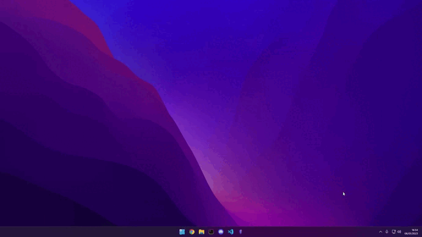
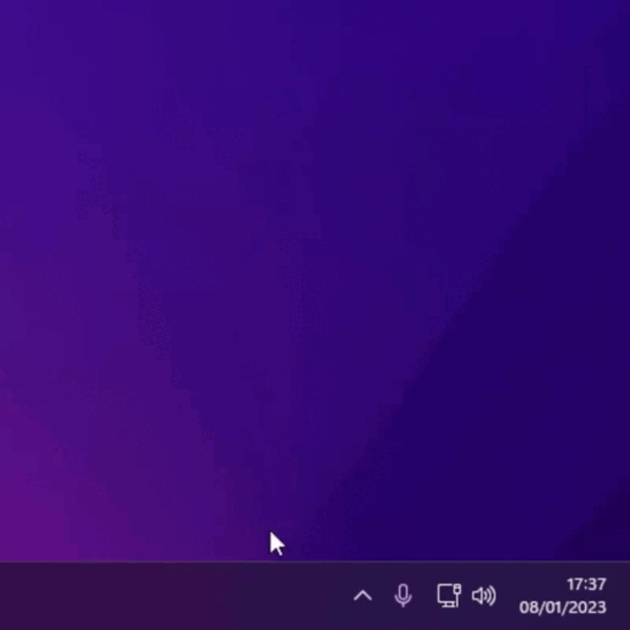

<h1 align="center">
  <br>
  <a href="#"></a>
  <br>
  Center Apps Windows
  <br>
</h1>

<h4 align="center">A minimalist program to center applications on the desktop</h4>

<p align="center">
<a target="_blank" href="https://www.python.org/about/"></a> 
<a></a>
<a target="_blank" href="https://github.com/AbianS/master/LICENSE.md"></a>
</p>


<p align="center">
  <a href="#how-to-use">How To Use</a> •
  <a href="#Roadmap">RoadMap</a> •
  <a href="#license">License</a>
</p>




## How To Use

To use it is very easy, you can download the executable and run it.

To center the application in the window simply press `ctrl + alt` and the program will detect which application is in the foreground and center it with respect to the dimensions of your monitor.

### Python

You can also download the python file and run it from the command line.

```bash
python './CenterApp.py'
```

> **Note**
> If you want to use the program with Python remember that the execution will be tied to the terminal, so once you close the terminal the program will stop.

### Stop the program

To stop the program follow the steps detailed in the video




## Roadmap

- Add an option for the user to specify which keyboard shortcuts he wants to use.

- Create an installer so that you can specify whether you want the application to start when you turn on the computer.

- Transfer all Python code to Rust to improve the efficiency of the program.

- Can be used on Windows, Linux and Mac

## License

MIT

---

> GitHub [@AbianS](https://github.com/AbianS) &nbsp;&middot;&nbsp;
> Twitter [@AbianS0](https://twitter.com/AbianS0)

